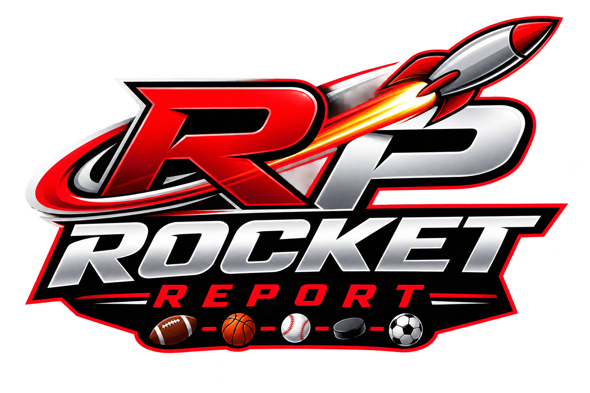

# RP Rocket Report

MLB betting analytics platform for daily wagering insights, model backtesting, and live odds recommendations.

## One-page Architecture

- **Dashboard engine:** `predictions.py` (Streamlit home + 6 feature pages)
- **UX pages:**
  - `pages/1_Today.py` — Today (schedule & game drill-down, game context factors, weather + odds, deep dive link)
  - `pages/2_Stats.py` — Stats (standings, team batting/pitching, leaders)
  - `pages/3_Matchup_Analysis.py` — Matchup Analysis (H2H & rolling form)
  - `pages/4_Models.py` — Models (features, model importances, calibration, Savant research)
  - `pages/5_Performance.py` — Performance (pick history, P/L, bankroll/Kelly calculator)
  - `pages/6_Pick_6.py` — Pick 6 (player prop probabilities, DK optimizer, season leaders)
  - `pages/7_Info.py` — About (methodology, sources, tech stack)

- **Shared utilities:** `page_utils.py` (data loader, odds integration, plot helpers, formatting, sidebar)
- **Data source directory:** `data_files/` (`raw/` CSVs + `processed/` Parquet)

## Feature Summary

### Daily Predictions
- `predictions.py` home:
  - Daily game schedule with lineups, SP matchup, status
  - Per-game recommendations (Moneyline, Run Line, Over/Under)
  - Odds harvest from ESPN live API (plus ESPN core event odds fallback)
  - Live Odds API multi-book feed via `ODDS_API_KEY` / `st.secrets` and auto fallback to saved CSV
  - Deep link button to game detail page on Today from main Home card
  - Edge-based bet signal (✅ BET, ➡ LEAN, ⛔ PASS)
  - Historical expected totals via Retrosheet `RS_per_G`
  - One-click page navigation tiles to deeper analysis

### Stats & Analysis
- Standings and team-level offensive/defensive boxscore trends
- Batting/pitching leaderboards with year filters and interactive charts
- Head-to-head series history and 30/60/90-day rolling records
- Game Context factors in Today detail view:
  - park factor, umpire park run environment, bullpen workload, platoon advantage, rest days, IL list
- Line movement, heavy favorite reactions, and situational splits

### ML Models and Backtest
- Underdog ML: upset moneyline model for +120 plus dogs
- Spread model: -1.5 / +1.5 win probability
- Totals model: over/under total, using ensemble blending and LightGBM/XGBoost
- Feature importance, calibration plots, confusion matrix, ROC-AUC
- Daily retrain pipeline via GitHub Actions + `scripts/train_models.py`

### Performance and Bankroll
- Backtests with trailing performance metrics (ROI, sharpe, max drawdown)
- Pick history and entry-level policies (confidence tiers: HIGH/MEDIUM/LOW)
- Kelly criterion calculator (`src/bankroll/kelly.py`) and bankroll growth simulation

### Recent updates
- Added live current-season support for 2026 team batting, team pitching, standings, and player leaderboards.
- Added early-season supplement handling for `batting_current.parquet`, `pitching_current.parquet`, `gameinfo_current.parquet`, and `teamstats_current.parquet`.
- Added reference-data ingestion for FanGraphs Guts! weights, FanGraphs park factors, and the Chadwick player registry.
- Added live fallback logic in Stats and Pick 6 pages so current-year data appears before a full precompute refresh.
- Updated nightly ingestion workflow and scheduler to refresh reference data automatically.

### Data Ingestion & Pipeline
- Custom ingestion scripts in `scripts/` and `src/ingestion/`:
  - `fetch_savant_leaderboards.py`, `build_parquet_data.py`, `precompute_data.py`
  - MLB Stats API, PyBaseball, Retrosheet, weather, odds sources
- Parquet conversion + schema validation in `src/data/` (future-proof type-safe schema)

## Models & Stats Roadmap (docs)

| Phase | Status | Focus |
|-------|--------|-------|
| 00-01 | done | dataset architecture + source catalog |
| 02-03 | done | ingestion pipeline, schema, preprocessing |
| 04    | done | model training (XGBoost, LightGBM, ensembles) |
| 05    | done | evaluation dashboards, calibration, error analysis |
| 06    | done | picks engine + daily betting recommendations |
| 07    | done | optional API support (`src/api/`), data queries |
| 08    | done | Streamlit UI reshape to 7-page experience |
| 09    | in progress | CI/CD, Docker, deployment hardening |
| 10    | in progress | risk management, bankroll optimization, live edge widener |

## Quick Start

1. Clone repo:
   ```bash
   git clone https://github.com/gmalbert/baseball-predictions.git
   cd baseball-predictions
   ```
2. Create venv and install:
   ```bash
   python -m venv venv
   .\venv\Scripts\Activate.ps1
   pip install -r requirements.txt
   ```
3. Run training/ingestion once:
   ```bash
   python scripts/build_parquet_data.py
   python scripts/train_models.py
   ```
4. Launch site:
   ```bash
   streamlit run predictions.py
   ```

## Live Odds Behavior

- Uses ESPN scoreboard + per-game odds API (`sports.core.api.espn.com/v2/.../odds`)
- Caches for 30 minutes via `@st.cache_data`
- If no odds returned, app shows `Unavailable` and the match remains in schedule only

## Contributing

- Follow style and lint rules (ruff formatting) and type hints
- Add tests in `tests/` (mirrors `src/` structure)
- Model changes should include analysis notebook findings and updated contingency backtests

## Contact

For questions or feature requests, create an issue in GitHub with:
- Use case (model, market, UI)
- Sample game/date and your expected picker outcome
- Actual vs predicted output in the app

